# mGradingUSTP - Laporan Tes Lapangan

Tanggal dokumen: 10 Juni 2026  
Folder sumber: `/mnt/pioneer/Project_GradingTph_Mobile/Live_testing_documentation`  
Project: `mGradingUSTP`

## Executive Summary

- **Tes lapangan menghasilkan 499 record TBS valid** dari 8 live session pada rentang 2026-06-10 15:31:23 sampai 2026-06-10 15:51:45 atau sekitar 20.4 menit data tersimpan.
- **Threshold 50% sudah tercermin di data**: confidence minimum record adalah 0.5000, rata-rata 0.7071, dan maksimum 0.9107.
- **Hasil paling banyak adalah `terlalu masak` dan `masak`**: 296 record `terlalu masak` (59.3%) dan 202 record `masak` (40.5%).
- **Bukti visual tersedia dari video dan file app**, yaitu 6 video MP4 (4 video unik, 2 duplikat/referensi), 281 frame, dan 449 crop. Pada dataset ini belum ditemukan file `annotated_*.jpg`.

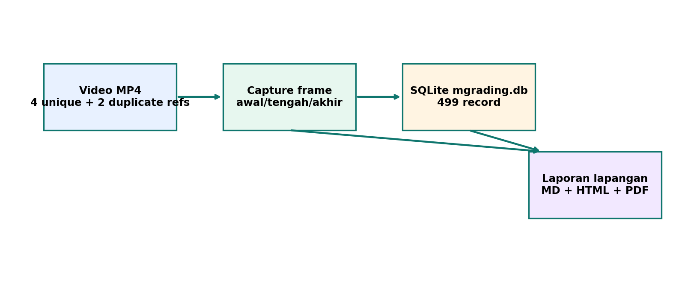

## 1. Sumber Data Lapangan

Data yang dianalisis berasal dari video screen recording/WhatsApp, database SQLite app, dan folder gambar app-specific storage.

| ID | Video utama | Durasi | Resolusi | Duplikat/referensi |
|---|---|---:|---|---|
| U01 | `WhatsApp Video 2026-06-10 at 4.14.10 PM.mp4` | 32.9s | 478x850 | - |
| U02 | `WhatsApp Video 2026-06-10 at 4.21.07 PM.mp4` | 80.1s | 390x850 | - |
| U03 | `WhatsApp Video 2026-06-10 at 4.22.30 PM.mp4` | 37.0s | 390x850 | - |
| U04 | `WhatsApp Video 2026-06-10 at 4.23.56 PM.mp4` | 45.5s | 390x850 | fmzac_WhatsApp Video 2026-06-10 at 4.23.56 PM.mp4; mhiqc_WhatsApp Video 2026-06-10 at 4.23.56 PM.mp4 |

File data utama:

| Sumber | Path | Catatan |
|---|---|---|
| SQLite | `com.ustp.mgrading/files/Documents/mgrading.db` | Schema `grading_tags`, user version 2 |
| Gambar | `com.ustp.mgrading/files/Pictures/grading/20260610/` | Berisi frame dan crop hasil simpan app |
| Arsip | `com.ustp.mgrading.rar` | Arsip sumber app data dari perangkat |

## 2. Ringkasan Hasil Deteksi

Distribusi label menunjukkan mayoritas record tersimpan berasal dari kelas `terlalu masak`, diikuti `masak`. Kelas `kurang masak` hanya muncul satu record dan kelas `mentah` tidak muncul pada data SQLite lapangan ini.

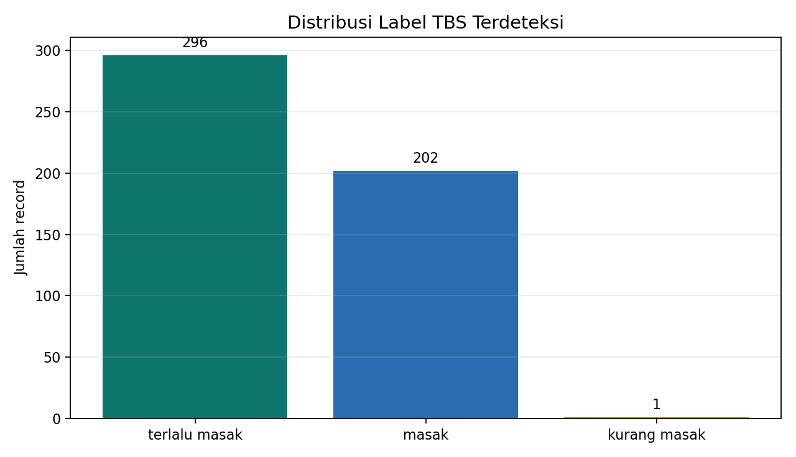

| Label | Record | Share | Confidence rata-rata | Min | Max |
|---|---:|---:|---:|---:|---:|
| terlalu masak | 296 | 59.3% | 0.7019 | 0.5000 | 0.8683 |
| masak | 202 | 40.5% | 0.7152 | 0.5058 | 0.9107 |
| kurang masak | 1 | 0.2% | 0.5943 | 0.5943 | 0.5943 |

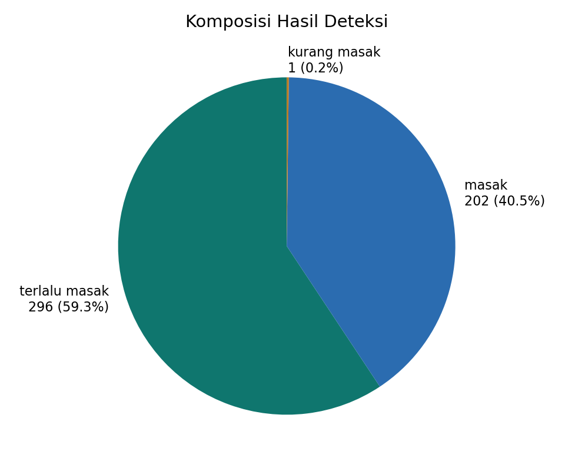

## 3. Confidence dan Kualitas Record

Sebaran confidence membantu membaca seberapa yakin model pada record yang benar-benar disimpan. Karena app hanya menyimpan data dengan confidence `>=50%`, grafik dimulai dari 0.50.

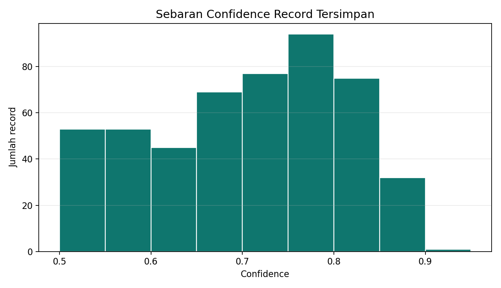

| Metrik | Nilai |
|---|---:|
| Total record | 499 |
| Confidence minimum | 0.5000 |
| Confidence rata-rata | 0.7071 |
| Confidence maksimum | 0.9107 |
| Jumlah live session | 8 |
| Rentang waktu data tersimpan | 1222.4 detik |

## 4. Aktivitas per Live Session

Grafik berikut menunjukkan jumlah record yang dibuat pada tiap sesi live. Ini berguna untuk melihat sesi mana yang paling padat dan berpotensi perlu audit duplikasi objek.

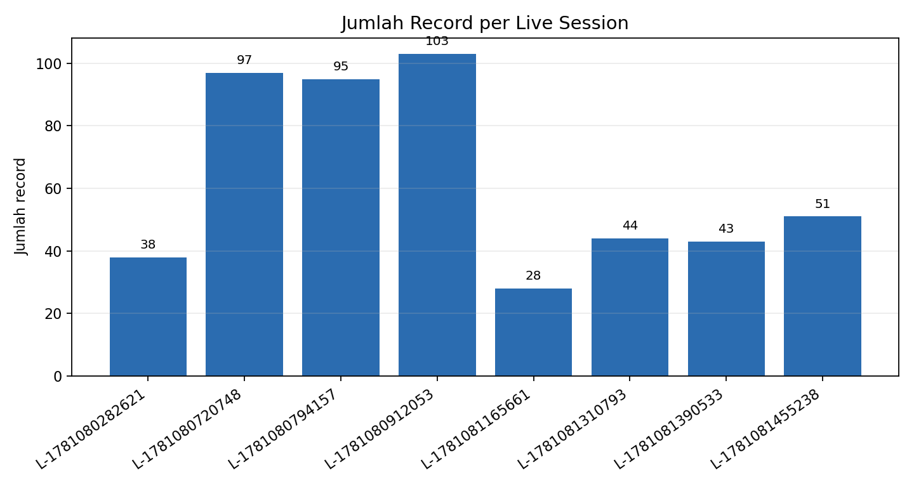

| Session | Record | Confidence rata-rata | Waktu awal | Waktu akhir | Durasi |
|---|---:|---:|---|---|---:|
| `LIVE-1781080282621` | 38 | 0.6860 | 2026-06-10 15:31:23 | 2026-06-10 15:31:49 | 26.0s |
| `LIVE-1781080720748` | 97 | 0.7162 | 2026-06-10 15:38:41 | 2026-06-10 15:38:57 | 15.7s |
| `LIVE-1781080794157` | 95 | 0.7251 | 2026-06-10 15:39:54 | 2026-06-10 15:40:55 | 61.0s |
| `LIVE-1781080912053` | 103 | 0.6604 | 2026-06-10 15:41:53 | 2026-06-10 15:45:37 | 224.1s |
| `LIVE-1781081165661` | 28 | 0.8319 | 2026-06-10 15:46:06 | 2026-06-10 15:46:28 | 22.2s |
| `LIVE-1781081310793` | 44 | 0.7076 | 2026-06-10 15:48:32 | 2026-06-10 15:49:09 | 36.6s |
| `LIVE-1781081390533` | 43 | 0.7124 | 2026-06-10 15:49:53 | 2026-06-10 15:50:23 | 30.1s |
| `LIVE-1781081455238` | 51 | 0.6925 | 2026-06-10 15:50:57 | 2026-06-10 15:51:45 | 48.1s |

## 5. Capture dari Video Lapangan

Capture berikut diambil otomatis dari awal, tengah, dan akhir setiap video unik. File video duplikat tetap dicatat sebagai referensi sumber, tetapi tidak dianalisis berulang agar dokumentasi tidak menggandakan skenario yang sama.

### Capture U01 - WhatsApp Video 2026-06-10 at 4.14.10 PM.mp4

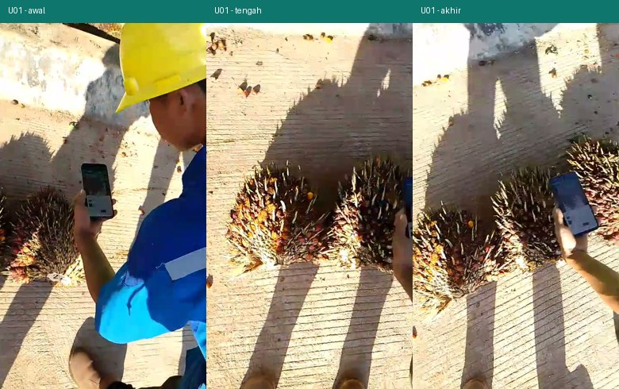

### Capture U02 - WhatsApp Video 2026-06-10 at 4.21.07 PM.mp4

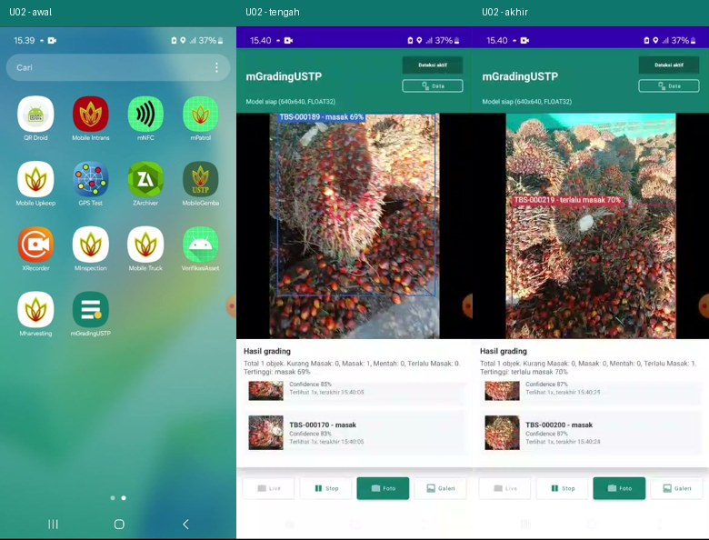

### Capture U03 - WhatsApp Video 2026-06-10 at 4.22.30 PM.mp4

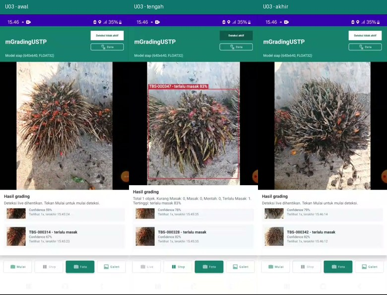

### Capture U04 - WhatsApp Video 2026-06-10 at 4.23.56 PM.mp4

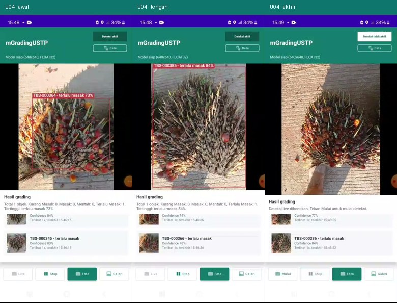

Catatan: file referensi/duplikat untuk video ini: `fmzac_WhatsApp Video 2026-06-10 at 4.23.56 PM.mp4; mhiqc_WhatsApp Video 2026-06-10 at 4.23.56 PM.mp4`.

## 6. Bukti Gambar dari App

Folder app menyimpan 281 frame penuh dan 449 crop objek. Grid berikut memakai crop dengan confidence tinggi dan beberapa label berbeda sebagai contoh bukti visual record yang masuk SQLite.

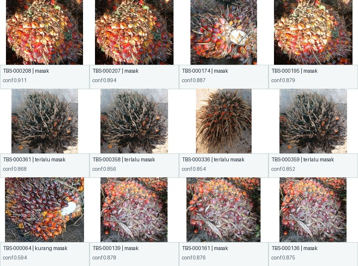

Contoh frame penuh dari record tersimpan:

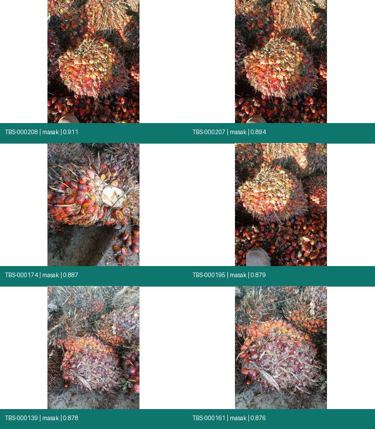

## 7. Catatan Teknis

- DB lapangan memakai table `grading_tags` dengan schema yang sesuai aplikasi: `tag_code`, `label`, `confidence`, bbox, path gambar, fingerprint, session, dan timestamp.
- Prefix tag pada dataset sudah memakai `TBS-xxxxxx`, sesuai perubahan terminologi terbaru.
- Tidak ada record dengan confidence di bawah 0.50, sehingga aturan simpan/list 50% berjalan sesuai desain.
- Field `annotated_image_path` tersedia di schema, tetapi dataset folder ini tidak memuat file `annotated_*.jpg`. Ini berarti dokumentasi foto beranotasi belum bisa dibuktikan dari paket data lapangan ini.
- Semua record memiliki `seen_count = 1` pada sampel awal dan top confidence yang diperiksa, sehingga audit lanjutan perlu melihat apakah dedup objek sama sudah cukup kuat pada semua skenario.

## 8. Rekomendasi Lanjutan

1. Tambahkan export CSV/ZIP dari app agar data lapangan bisa dibagikan tanpa Device Explorer.
2. Pastikan mode `Foto` selalu menghasilkan dan menyimpan `annotated_*.jpg`, lalu masukkan path-nya ke `annotated_image_path`.
3. Tambahkan validasi manual ground truth untuk sebagian crop/frame supaya laporan berikutnya bisa menghitung precision, recall, dan error label.
4. Pertimbangkan halaman filter di menu Data: filter session, label, tanggal, dan confidence.
5. Untuk mengurangi potensi duplikasi pada live zoom out, tambahkan evaluasi tracking berbasis IoU antar-frame atau embedding ringan selain average hash.

## 9. Artefak Pendukung

| Artefak | Path |
|---|---|
| Ringkasan video | `assets/tables/video_inventory.csv` |
| Capture video | `assets/tables/video_captures.csv` |
| Ringkasan label | `assets/tables/label_summary.csv` |
| Ringkasan session | `assets/tables/session_summary.csv` |
| Top confidence records | `assets/tables/top_confidence_records.csv` |
| Chart label | `assets/charts/label_distribution.png` |
| Chart session | `assets/charts/session_records.png` |
| Histogram confidence | `assets/charts/confidence_histogram.png` |
| Grid crop | `assets/images/sample_crops_grid.jpg` |
