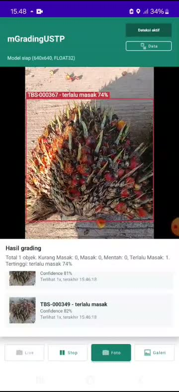
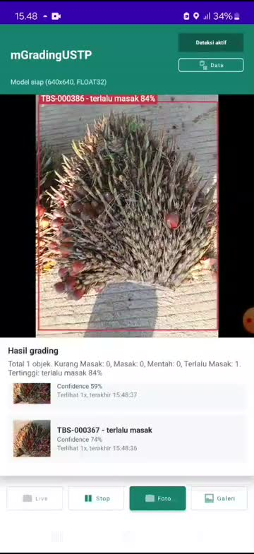
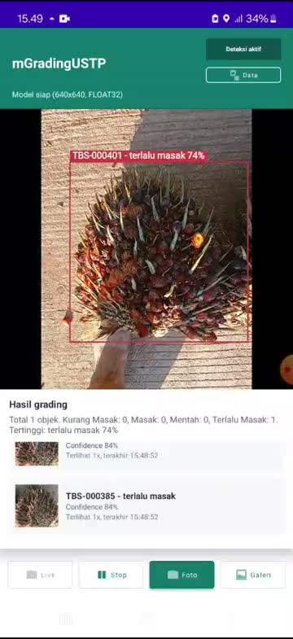

# mGradingUSTP

`mGradingUSTP` adalah aplikasi Android native untuk membantu grading Tandan Buah Segar (TBS) kelapa sawit secara offline. Aplikasi memakai kamera Android, TensorFlow Lite, overlay bounding box, penyimpanan gambar, dan SQLite lokal untuk mencatat hasil deteksi lapangan.

Repository GitHub ini hanya berisi project Android dan dokumentasi ringkas. Model TFLite, data lapangan, video, database, APK, notebook, dan file training tidak ikut dipush.

## Demo Lapangan

<p align="center">
  
</p>

<p align="center">
  
  
  
</p>

Demo di atas berasal dari tes lapangan 10 Juni 2026. Asset yang disimpan di repository hanya GIF/JPG kecil untuk README; video asli dan data mentah tetap tidak ikut dipush.

## Ringkasan Fitur

- Live camera detection menggunakan CameraX.
- Deteksi live hanya berjalan setelah user menekan tombol `Mulai`.
- Tombol `Stop` menghentikan deteksi tanpa menutup preview kamera.
- Status kanan atas menampilkan `Deteksi aktif` atau `Deteksi tidak aktif`.
- Mode `Foto` untuk mengambil gambar dan menjalankan deteksi pada foto.
- Mode `Galeri` untuk memilih gambar dari storage.
- Overlay menampilkan bounding box, label grading, confidence, dan kode tag.
- Data valid disimpan ke SQLite external app storage dengan nama `mgrading.db`.
- Menu `Data` menampilkan daftar data TBS yang sudah tersimpan.
- Prefix tag memakai format `TBS-000001`, `TBS-000002`, dan seterusnya.

## Alur Penggunaan

1. Buka aplikasi.
2. Preview kamera tampil, tetapi deteksi belum aktif.
3. Tekan `Mulai` untuk memulai deteksi live.
4. Arahkan kamera ke TBS atau berondolan.
5. Jika confidence objek `>=50%`, aplikasi membuat tag TBS, menyimpan gambar, dan mencatat data ke SQLite.
6. Jika kamera kembali ke objek yang sudah tersimpan, tag lama ditampilkan dan record baru tidak dibuat.
7. Tekan `Foto` untuk mengambil gambar dan menyimpan hasil deteksi foto.
8. Tekan `Data` untuk melihat daftar data TBS tersimpan.
9. Tekan `Stop` untuk menghentikan deteksi.

## Ringkasan Teknis

Arsitektur utama:

| Layer | Komponen | Fungsi |
|---|---|---|
| UI | `DetectionActivity`, XML layout | Kamera, tombol, status, overlay, list hasil |
| State | `DetectionViewModel` | Kontrol sesi live, threshold, tagging, summary |
| ML | `TfliteDetector` | Load model TFLite, inference, decode YOLO, NMS |
| Storage | `GradingTagRepository`, `GradingDbHelper` | SQLite external, tag TBS, dedup, migration |
| File | `GradingImageStore` | Simpan frame, crop, dan foto hasil deteksi |
| Data UI | `SavedTagsActivity`, `GradingTagAdapter` | Form/list data TBS tersimpan |

Konfigurasi deteksi:

| Parameter | Nilai |
|---|---:|
| Input model | `640 x 640` |
| Raw inference threshold | `0.25` |
| Threshold simpan/list | `0.50` |
| NMS IoU threshold | `0.45` |
| Fingerprint match distance | `<=10` |

Label model:

| ID | Label |
|---:|---|
| 0 | `kurang masak` |
| 1 | `masak` |
| 2 | `mentah` |
| 3 | `terlalu masak` |

## Storage Lokal

Database SQLite dibuat di external app-specific storage:

```text
/sdcard/Android/data/com.ustp.mgrading/files/Documents/mgrading.db
```

Gambar hasil deteksi dibuat di:

```text
/sdcard/Android/data/com.ustp.mgrading/files/Pictures/grading/YYYYMMDD/
```

Jenis file gambar:

| Prefix | Isi |
|---|---|
| `frame_*.jpg` | Frame penuh saat objek valid disimpan |
| `crop_*.jpg` | Crop objek TBS/berondolan |
| `annotated_*.jpg` | Foto penuh dengan bounding box dan tag |

## Model TFLite

Model TFLite tidak ikut dipush ke GitHub. Sebelum menjalankan deteksi, letakkan model lokal di:

```text
app/src/main/assets/grading_tph_int8.tflite
```

File ini sengaja di-ignore oleh Git:

```text
app/src/main/assets/*.tflite
```

Asset ringan yang tetap ikut repo:

```text
app/src/main/assets/README_MODEL.txt
app/src/main/assets/labels.txt
```

Jika model belum tersedia, aplikasi akan menampilkan pesan bahwa model TFLite perlu diletakkan di folder assets.

## Ringkasan Tes Lapangan

Tes lapangan pada 10 Juni 2026 menghasilkan dokumentasi internal berikut:

| Metrik | Hasil |
|---|---:|
| Record TBS valid | 499 |
| Live session | 8 |
| Video MP4 | 6 file, 4 video unik |
| Frame tersimpan | 281 |
| Crop tersimpan | 449 |
| Confidence minimum | 0.5000 |
| Confidence rata-rata | 0.7071 |
| Confidence maksimum | 0.9107 |

Distribusi label dari data lapangan:

| Label | Record | Share |
|---|---:|---:|
| `terlalu masak` | 296 | 59.3% |
| `masak` | 202 | 40.5% |
| `kurang masak` | 1 | 0.2% |
| `mentah` | 0 | 0.0% |

Catatan: data lapangan mentah, video, DB SQLite, dan dokumentasi lengkap tidak masuk repository ini agar repo tetap fokus pada project Android dan tidak membawa file besar/sensitif.

## Struktur Project GitHub

```text
mGradingUSTP/
├── app/
│   ├── build.gradle
│   └── src/main/
│       ├── AndroidManifest.xml
│       ├── assets/
│       │   ├── README_MODEL.txt
│       │   └── labels.txt
│       ├── java/com/ustp/mgrading/
│       └── res/
├── gradle/wrapper/
├── build.gradle
├── settings.gradle
├── gradle.properties
├── gradlew
├── .gitignore
└── README.md
```

## Build

Gunakan Android Studio atau Gradle CLI.

```bash
./gradlew assembleDebug
```

Jika JDK default terlalu baru untuk Android Gradle Plugin, gunakan JDK 17:

```bash
JAVA_HOME=/usr/lib/jvm/java-17-openjdk ./gradlew assembleDebug
```

## Menyiapkan Model Lokal

Contoh setelah clone repo:

```bash
cp /path/to/grading_tph_int8.tflite app/src/main/assets/grading_tph_int8.tflite
JAVA_HOME=/usr/lib/jvm/java-17-openjdk ./gradlew assembleDebug
```

Pastikan model tidak masuk commit:

```bash
git check-ignore -v app/src/main/assets/grading_tph_int8.tflite
```

## Push ke GitHub

Jika repository GitHub sudah dibuat:

```bash
git init
git branch -M main
git add .gitignore README.md build.gradle settings.gradle gradle.properties gradlew gradle app
git status --short
git commit -m "Initial commit mGradingUSTP Android project"
git remote add origin https://github.com/<username>/mGradingUSTP.git
git push -u origin main
```

Sebelum commit, pastikan file berikut tidak muncul di `git status`:

- `app/src/main/assets/grading_tph_int8.tflite`
- `Live_testing_documentation/`
- `docs/`
- `.venv/`
- `.gradle/`
- `*.pt`
- `*.onnx`
- `*.apk`
- `*.mp4`
- `*.webm`
- `*.db`

## Catatan Repository

- Repository ini tidak menyimpan model dan data lapangan.
- File model, DB, video, APK, notebook, dan tools export tetap berada di mesin lokal.
- Jika ingin membagikan model, gunakan release/private storage terpisah dan jangan commit binary model langsung ke source repository.
# mGrading
