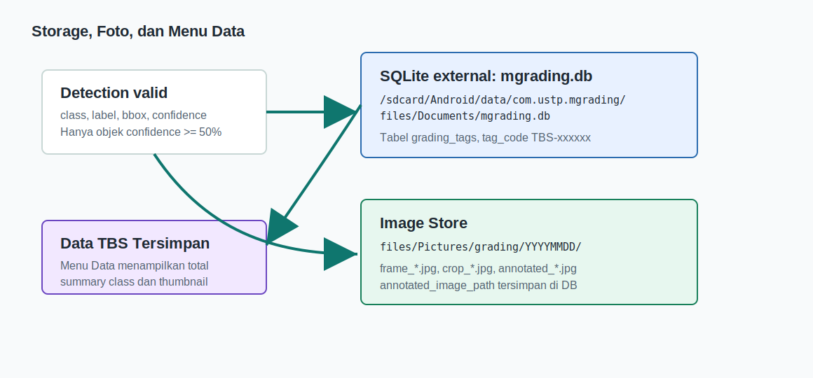

# mGradingUSTP - Dokumentasi Teknikal Live Multi-Objek TBS

Tanggal dokumen: 9 Juni 2026  
Project: `mGradingUSTP`  
Lokasi project: `/mnt/pioneer/Project_GradingTph_Mobile`

## 1. Ringkasan Status Terbaru

Aplikasi Android `mGradingUSTP` sekarang diarahkan untuk grading TBS secara mobile dengan dua mode: live camera dan foto. Kamera boleh menampilkan preview sejak app dibuka, tetapi proses deteksi tidak berjalan sebelum user menekan tombol `Mulai`.

| Area | Status terbaru | Catatan |
| --- | --- | --- |
| Terminologi | TBS | Nama tag baru memakai prefix `TBS-xxxxxx`; data lama `TPH-` dimigrasikan ke `TBS-`. |
| Mulai/Stop | Implemented | Deteksi live hanya aktif setelah `Mulai`; `Stop` menghentikan analyzer dan auto-save. |
| Status kanan atas | Implemented | `Deteksi aktif` saat live berjalan dan `Deteksi tidak aktif` saat stop/awal app. |
| Threshold simpan/list | 50% | Data masuk overlay, list, dan SQLite hanya jika confidence `>= 0.50`. |
| Menu Data | Implemented | Tombol `Data` membuka daftar record TBS tersimpan dari SQLite. |
| SQLite external | Implemented | DB tersimpan sebagai `mgrading.db` di external app-specific storage. |
| Foto anotasi | Implemented | Frame/crop/foto beranotasi disimpan sebagai JPEG. |


## 2. User Flow Lapangan

1. User membuka app; kamera preview tampil, tetapi deteksi belum aktif.
2. User menekan `Mulai`; status kanan atas berubah menjadi `Deteksi aktif`.
3. User mengarahkan kamera ke satu TBS atau berondolan.
4. Jika confidence `>=50%`, app memberi tag `TBS-xxxxxx`, menyimpan gambar, dan mencatat data ke SQLite.
5. Jika user mengarah ke objek yang sama, app menampilkan tag lama dan tidak membuat record baru.
6. Jika user pindah ke objek lain, app membuat tag baru jika fingerprint tidak cocok dengan data lama.
7. Jika user zoom out, beberapa TBS bisa tampil bersamaan dan semua objek valid diproses.
8. User menekan `Foto`; app menyimpan foto hasil deteksi/anotasi keseluruhan.
9. User menekan `Stop`; status berubah menjadi `Deteksi tidak aktif` dan deteksi berhenti.
10. User menekan `Data` untuk melihat record TBS tersimpan.


## 3. Arsitektur Aplikasi

| Layer | Komponen | Tanggung jawab |
| --- | --- | --- |
| UI | `DetectionActivity`, XML layout, ViewBinding | Kamera, tombol `Mulai`, `Stop`, `Foto`, `Galeri`, `Data`, status badge, overlay, list hasil. |
| ViewModel | `DetectionViewModel` | State deteksi aktif/tidak, sesi live, threshold 50%, tagging multi-objek, summary. |
| ML | `TfliteDetector`, `DetectionResult` | Inference TFLite, decode YOLO, confidence raw, NMS, mapping label. |
| Storage | `GradingTagRepository`, `GradingDbHelper` | SQLite external, migrasi `TPH-` ke `TBS-`, query match, insert/update tag. |
| File | `GradingImageStore` | Simpan `frame_*.jpg`, `crop_*.jpg`, dan `annotated_*.jpg`. |
| Data UI | `SavedTagsActivity`, `GradingTagAdapter` | Menampilkan total, ringkasan kelas, thumbnail, tag, confidence, waktu, dan path DB. |

## 4. Aturan Deteksi Live


### 4.1 Deteksi harus dimulai manual

Ketika app baru dibuka:

- Kamera preview tetap aktif.
- `liveDetectionActive = false`.
- Analyzer tidak menjalankan inference untuk auto-detection.
- Status kanan atas menampilkan `Deteksi tidak aktif`.

Saat user menekan `Mulai`:

- `DetectionActivity` memanggil start live detection.
- `DetectionViewModel.startLiveSession()` membuat `sessionId` baru dengan format `LIVE-{timestamp}`.
- `sessionSeenTagIds` dikosongkan.
- Status berubah menjadi `Deteksi aktif`.

Saat user menekan `Stop`:

- Analyzer berhenti memproses frame.
- Overlay aktif dibersihkan.
- Status berubah menjadi `Deteksi tidak aktif`.
- Kamera tetap bisa menampilkan preview.

### 4.2 Threshold simpan/list 50%

Ada dua jenis threshold:

| Threshold | Nilai | Dipakai untuk |
| --- | --- | --- |
| Raw inference threshold | `0.25` | Membatasi kandidat awal dari model TFLite. |
| Auto-save/list threshold | `0.50` | Syarat objek masuk overlay final, list, foto, dan SQLite. |
| IoU/NMS threshold | `0.45` | Menghapus box duplikat yang terlalu overlap. |
| Fingerprint match distance | `<=10` | Menentukan apakah objek baru cocok dengan record lama. |

Pseudo-flow tagging:

```text
for each detection:
  if liveDetectionActive is false:
    skip inference/live save
  if confidence < 0.50:
    show no saved tag and do not insert DB
  crop object from frame
  calculate averageHash fingerprint
  search SQLite by class_id and fingerprint distance
  if match found:
    show existing TBS tag
    update last_seen/seen_count once per session
  else:
    save frame and crop image
    insert SQLite record
    generate TBS-xxxxxx tag
```

## 5. Mode Foto

Mode foto tetap menjalankan detection pada gambar yang diambil user. Perilaku yang dipakai sama dengan live mode untuk data valid:

- Objek dengan confidence `>=50%` diberi tag dan masuk summary.
- Foto final dibuat sebagai `annotated_*.jpg` dengan bounding box dan tag TBS.
- Record SQLite terkait di-update dengan `annotated_image_path`.
- Saat foto diproses, analyzer live dipause agar overlay foto tidak tertimpa frame live berikutnya.

## 6. Menu Data dan Form Daftar Tersimpan

Menu `Data` membuka halaman `Data TBS Tersimpan`. Halaman ini dibuat agar user bisa mengaudit hasil deteksi yang sudah masuk SQLite.

| Elemen halaman | Isi |
| --- | --- |
| Header | Judul `Data TBS Tersimpan`, tombol kembali, tombol refresh. |
| Ringkasan total | Jumlah record TBS tersimpan. |
| Ringkasan kelas | Jumlah data per label, misalnya `masak`, `mentah`, `kurang masak`, `terlalu masak`. |
| Path DB | Lokasi file `mgrading.db` di external app storage. |
| List record | Thumbnail, kode `TBS-xxxxxx`, label, confidence, waktu terlihat, dan seen count. |

## 7. Storage dan SQLite



### 7.1 Path database

```text
/sdcard/Android/data/com.ustp.mgrading/files/Documents/mgrading.db
```

Di Android Studio Device Explorer:

```text
storage/emulated/0/Android/data/com.ustp.mgrading/files/Documents/mgrading.db
```

### 7.2 Path gambar

```text
/sdcard/Android/data/com.ustp.mgrading/files/Pictures/grading/YYYYMMDD/
```

| Prefix file | Isi |
| --- | --- |
| `frame_*.jpg` | Frame penuh saat objek valid disimpan. |
| `crop_*.jpg` | Crop objek TBS/berondolan. |
| `annotated_*.jpg` | Foto penuh dengan bounding box dan tag. |

### 7.3 Schema SQLite

Tabel: `grading_tags`  
Database version: `2`

| Kolom | Tipe | Keterangan |
| --- | --- | --- |
| `id` | INTEGER PK | ID auto increment. |
| `tag_code` | TEXT UNIQUE | Kode tag, contoh `TBS-000140`. |
| `class_id` | INTEGER | ID kelas model. |
| `label` | TEXT | Label grading. |
| `confidence` | REAL | Confidence tertinggi yang tersimpan. |
| `bbox_left/top/right/bottom` | REAL | Koordinat bounding box. |
| `image_path` | TEXT | Path frame penuh. |
| `crop_path` | TEXT | Path crop objek. |
| `annotated_image_path` | TEXT | Path foto penuh beranotasi. |
| `fingerprint` | TEXT | Average hash crop untuk dedup. |
| `session_id` | TEXT | ID sesi live atau foto. |
| `created_at` | INTEGER | Timestamp record dibuat. |
| `last_seen_at` | INTEGER | Timestamp terakhir terlihat. |
| `seen_count` | INTEGER | Jumlah kemunculan terhitung. |

Migration penting:

- DB lama `mgrading_ustp.db` disalin sekali ke `mgrading.db` jika file external belum ada.
- Upgrade schema memakai `ALTER TABLE`, tidak drop data.
- Record lama dengan `tag_code` prefix `TPH-` dimigrasikan menjadi `TBS-`.

## 8. Model TFLite

```text
app/src/main/assets/grading_tph_int8.tflite
```

Nama file asset masih mengandung `tph` untuk menjaga kompatibilitas kode dan file training lama. Nama produk, tag, dan UI sudah memakai istilah TBS.

| ID | Label |
| --- | --- |
| 0 | `kurang masak` |
| 1 | `masak` |
| 2 | `mentah` |
| 3 | `terlalu masak` |

## 9. Acceptance Test

| Skenario | Langkah | Hasil yang diharapkan |
| --- | --- | --- |
| Awal app | Buka app | Preview tampil, status `Deteksi tidak aktif`, belum ada inference live. |
| Start live | Tekan `Mulai` | Status `Deteksi aktif`, tombol Mulai menjadi mode live, analyzer berjalan. |
| Stop live | Tekan `Stop` | Status `Deteksi tidak aktif`, overlay aktif hilang, auto-save berhenti. |
| Threshold 50% | Arahkan ke objek confidence `>=50%` | Tag TBS muncul dan data masuk list/DB. |
| Di bawah 50% | Arahkan ke objek confidence `<50%` | Tidak disimpan ke list/DB. |
| Objek sama | Tetap arahkan kamera ke TBS yang sama | Tag lama tampil, record baru tidak dibuat. |
| Objek lain | Pindah ke TBS lain | Tag baru dibuat jika fingerprint berbeda. |
| Zoom out | Kamera melihat banyak TBS | Semua objek valid diproses dan diberi tag. |
| Foto final | Tekan `Foto` | Foto beranotasi tersimpan. |
| Menu Data | Tekan `Data` | Halaman daftar TBS tersimpan terbuka. |

Command build:

```bash
JAVA_HOME=/usr/lib/jvm/java-17-openjdk ./gradlew --no-daemon --console=plain assembleDebug
```

Path APK debug:

```text
app/build/outputs/apk/debug/app-debug.apk
```

## 10. Risiko Teknis

- Fingerprint average hash ringan untuk mobile, tetapi belum setara object tracking penuh.
- Objek yang sangat mirip, sangat dekat, dan berada pada sudut kamera yang sama bisa dianggap match.
- Threshold 50% membuat app lebih mudah menyimpan objek valid, tetapi data bisa lebih banyak sehingga review pada menu Data menjadi penting.
- External app-specific storage mudah dilihat lewat Device Explorer, tetapi akan ikut hilang jika app di-uninstall.

## 11. Ringkasan File Implementasi

| File | Fungsi |
| --- | --- |
| `DetectionActivity.java` | UI, CameraX, tombol Mulai/Stop/Foto/Galeri/Data, status badge. |
| `DetectionViewModel.java` | State live, threshold 50%, multi-object tagging, summary. |
| `SavedTagsActivity.java` | Halaman Data TBS Tersimpan. |
| `activity_detection.xml` | Layout kamera, overlay, kontrol bawah, status kanan atas. |
| `activity_saved_tags.xml` | Layout daftar data tersimpan. |
| `GradingTagRepository.java` | Insert/update/query SQLite, tag TBS, migrasi prefix. |
| `GradingDbHelper.java` | External DB dan migration schema. |
| `GradingImageStore.java` | Simpan frame/crop/annotated JPEG. |
| `OverlayView.java` | Render bounding box dan label TBS. |
